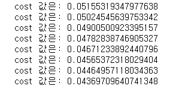

## 1. Simple linear regression 활용 머신러닝 예제 - 데이터 준비

주어진 온도, 오존 데이터를 활용하여 simple linear regression 경향성을 파악하여 예측한다.
EDA를 통해 데이터 정제(NA, 이상치)를 우선적으로 실행해야 한다.
데이터는 깃허브 머신러닝 repository에서 확인 가능하다. 
https://github.com/z2soo

<br>

### 1) Module import

```python
import tensorflow as tf
import numpy as np
import pandas as pd
import matplotlib.pyplot as plt	
```

<br>

### 2) 학습 데이터 불러오기

pandas 통해 파일 불러오고, fancy indexing 통해 필요한 열(Ozone, Temp) 만을 추출한다.

- pandas 이용한 파일 불러오기: **pd.read_csv( '주소/파일명' )**
- fancy indexing: df이름[ [ 'col이름' ] ]

```python
total_file = pd.read_csv('C:/Users/student/Desktop/머신러닝/ozone.csv')
df = total_file[['Ozone','Temp']]
print(f'읽어들인 데이터의 shape: {total_file.shape}')

# 읽어들인 데이터의 shape: (153, 6)
```

<br>

### 3) 학습 데이터 전처리

#### 결측치 처리

- dataframe 결측치 처리: **df이름.dropna( axis = , how = , inplace = )**

```python
df = df.dropna(how='any', inplace=False)
print(f'결측치를 제거한 후 남은 데이터: {df.shape}')

# inplace는 원본에 수행할지, 원본을 건들지 않고 값을 return 받을지에 대한 것 
# 결측치를 제거한 후 남은 데이터: (116, 2)
```

<br>

#### **이상치 처리**

boxplot을 사용해서 Temp(온도)와 Ozone(오존)에 대한 이상치를 파악한다.

- boxplot 그래프 그리기: **plt.boxplot( df이름 [ 'col이름' ] )**

```python
plt.boxplot(df['Temp'])
plt.boxplot(df['Ozone'])
```


점으로 표현되는 부분이 Ozone의 이상치로, 이상치를 찾기 위해서는 Tukey Fence 방식을 이용한다.

이상치를 다음과 같이 정의한다. 

- **IQR = Q3 - Q1**
  - **Q3 + IQR \* 1.5 초과하는 값** 
  - **Q1 - IQR \* 1.5 미만의 값**

<br>

- Numpy가 가진 4분위 함수: **np.percentile( data이름, 백분위 )**

```python
q1, q3 = np.percentile(df["Ozone"],[25,75])
print(q1, q3)

irq = q3-q1
upper = q3 + irq*1.5
print(upper)

# 아래 값의 결과가 논리값을 가진 시리즈로 프린트 될 것
mask = df["Ozone"] > upper #mask
df = df.loc[~mask]
print(f'이상치를 제거한 후 남은 데이터: {df.shape}')

# 18.0 63.25
# 131.125
# 이상치를 제거한 후 남은 데이터: (114, 2)
```

<br>

#### Normalization(표준화), Standardzation(정규화)

앞선 포스팅과 같이 표준화를 하지 않아도 머신러닝이 가능하다. 하지만, 값의 범위가 커짐에 따라서 학습이 정상적으로 이루어지지 않는 경우가 있다. (범위가 더 큰 변수의 영향을 더 받게 된다.) 

이에 정제된 데이터를 표준화 혹은 정규화를 이용해서 값의 범위를 조절하여 사용한다. 
둘 중 보다 적합한 것을 사용하면 되고, 정규화는 음수의 값이 나올 수 있다.

이때의 **표준화**는 **데이터의 값이 0-1 범위내에 존재하도록 비율적으로 축소시키는 작업**을 의미한다.


```python
df["Temp_Norm"] = (df["Temp"] - df["Temp"].min()) / (df["Temp"].max() - df["Temp"].min())
df["Ozone_Norm"] = (df["Ozone"] - df["Ozone"].min()) / (df["Ozone"].max() - df["Ozone"].min())
display(df)
```


<br>

#### 경향성 확인

scatter 그래프를 활용하여 흩어진 상태, 경향성을 확인한다. 그 결과, 우상향하는 데이터를 확인할 수 있다. 

- 산점도 그리는 함수: **plt.scatter( x축 데이터, y축 데이터 )**

```python
plt.scatter(df["Temp_Norm"], df["Ozone_Norm"])
```


<br><br>

## 2. Simple linear regression 이용한 머신러닝 예제 - 머신러닝

#### 1) Training data set 준비

```python
x_data = df["Temp_Norm"]
y_data = df["Ozone_Norm"]

x = tf.placeholder(dtype=tf.float32)
y = tf.placeholder(dtype=tf.float32)
```

<br>

#### 2) W, b 설정

```python
W = tf.Variable(tf.random_normal([1]), name = 'weight')
b = tf.Variable(tf.random_normal([1]), name = 'bias')
```

<br>

#### 3) Hyphothesis 설정

```python
H = W * x + b
```

<br>

#### 4) Cost function 설정

```python
cost = tf.reduce_mean(tf.square(H - y))
```

<br>

#### 5) Train node 설정

일반적으로 training rate는 0.01을 기본으로 잡고, 결과에 따라서 조금씩 변화를 준다.
미분과 같은 작업을 하는 Optimizer 알고리즘을 사용한다. 

```python
optimizer = tf.train.GradientDescentOptimizer(learning_rate=0.001)
train = optimizer.minimize(cost)
```

<br>

#### 6) Runner 설정 및 변수 초기화

변수의 경우 학습 실행 전에 반드시! 초기화를 해줘야 하며, 따라서 필수적으로 다음의 코드를 사용한다.

```python
sess = tf.Session()
sess.run(tf.global_variables_initializer())
```

<br>

#### 7) learning (학습) 실행

cost가 0에 가까워지는지 확인하기 위해서 cost도 같이 뽑아내보았다.
0에 전혀 가깝지 않은 cost 값이 나오는 경우, 변화를 줄 수 있는 부분은 learning rate 그리고 step 횟수이다.
단, 표준화를 하지 않은 경우, 두 부분에 변화를 준다고 하더라도 적당한 값이 나오지 않는 경우가 있다. 

```python
for step in range(10000):
    _, v_cost = sess.run([train, cost], 
                         feed_dict={ x: x_data, y: y_data })
    if step % 300 ==0:
        print(f'cost 값은: {v_cost}')
```



<br>

#### 8) 최적화 가설 및 예측

#### 최적화 가설

W와 b는 노드이기 때문에 sess.run을 통해 실행을 시켜줘야지만 값을 얻을 수 있다.

첫 번째 식은 데이터에 대한 산점도를 표현한 것
두 번재 식은 최적화된 가정에 대한 식을 표현한 것

```python
plt.scatter(df["Temp_Norm"], df["Ozone_Norm"]) 
plt.plot(df["Temp_Norm"], df["Temp_Norm"] * sess.run(W) + sess.run(b)) 
# x = df["Temp_Norm"], H = x * W + b
```


<br>

#### 예측

화씨 81도에서의 오존 예측 해보자.

```python
print(sess.run(H, feed_dict = {x: 81})) 
```

생각해보면 우리는 81를 0-1의 숫자로 변화시켰었고, 따라서 예측할 때도 마찬가지로 변화시켜 넣어야 한다. 
예측되어 나온 값 또한 정규화 과정을 역으로 진행해야지 원래의 값으로 나온다. 

```python
tmp = (81 - df["Temp"].min()) / (df["Temp"].max() - df["Temp"].min()) 
result_norm = sess.run(H, feed_dict = { x: tmp }) 
result = result_norm * (df["Ozone"].max() - df["Ozone"].min()) + df["Ozone"].min() 
print(result)

# [106.9547]
# [51.48693]
```