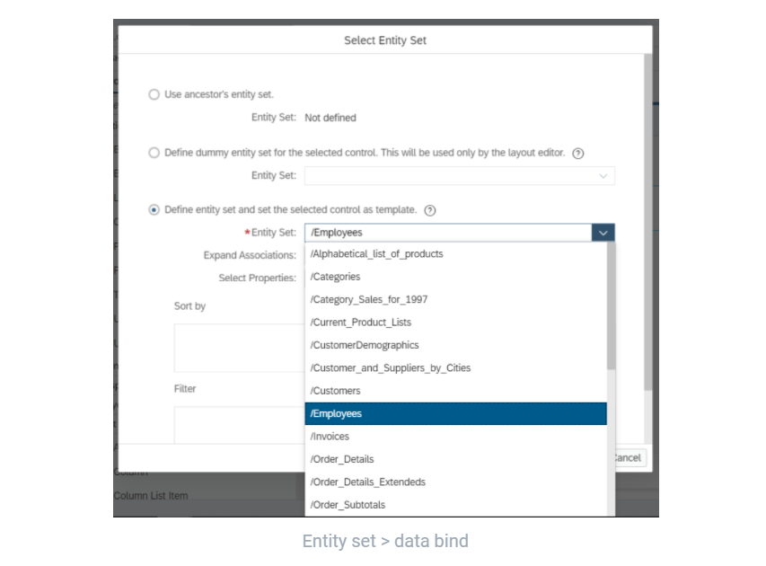
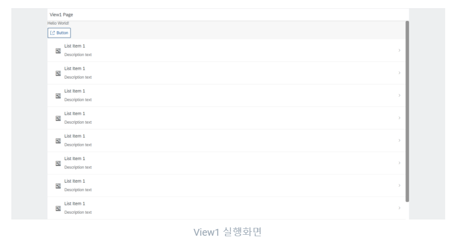
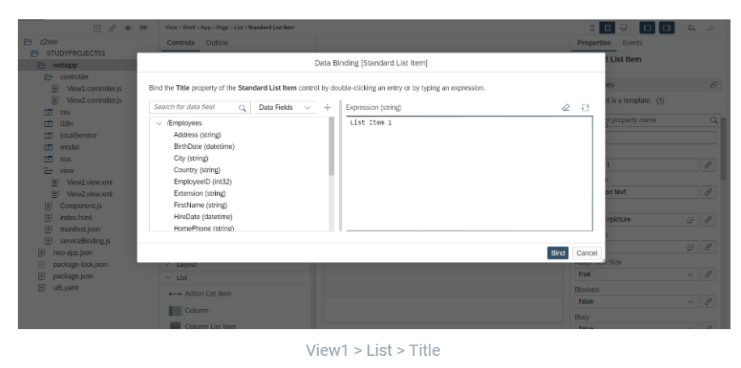
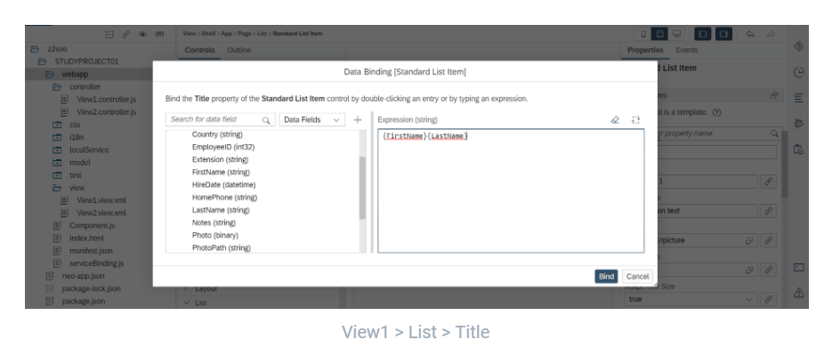
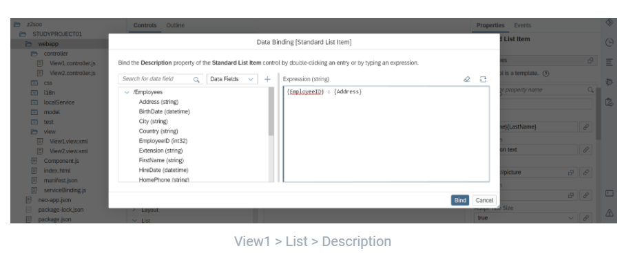
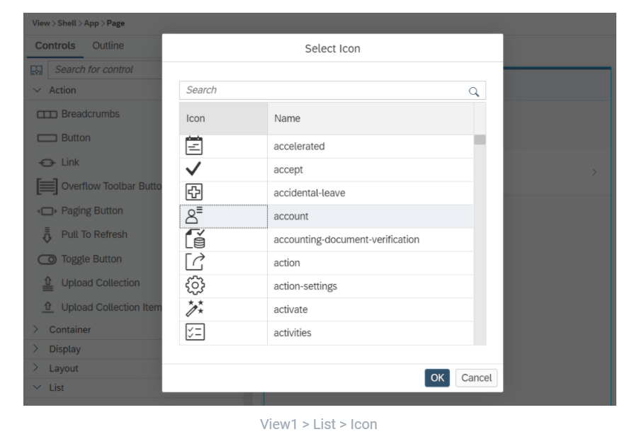
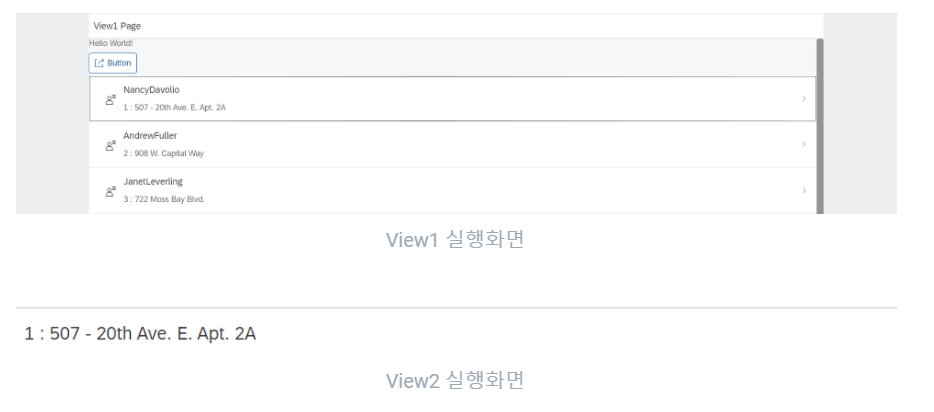

## 1. 데이터 연결 및 모델 등록

### 1) URL 데이터 추가

- manifest.json 파일 > Data source > 추가 버튼 + > 데이터 정보 입력 

manifest.json 파일의 Data source 탭으로 이동해서 추가 버튼을 눌러주면 팝업 창이 뜬다.

 

지금은 URL 주소를 활용해서 데이터를 가져올 것이기 때문에 Service URL을 선택해주고, create a new data source를 클릭한다. 

 create a new data source를 클릭하면 다음과 같은 팝업창이 뜬다. 이용자 메일과 비밀번호를 입력해주고, oData 이름 설정 및 바인드 하고자 하는 데이터의 URL을 입력해준다. URL을 통해 데이터를 가져올 것이기 떄문에 Procy Type은 Internet 그대로 둔다. 

 

아래와 같은 화면이 나오면 등록이 완료되었다.

 

### 2) 데이터 연결 확인

- SAP Cockpit neo 평가판 화면 > 연결 > 대상 > 적합한지 확인

URL 데이터 연결이 잘 되었는지 확인을 위해서는  SAP Cockpit neo 평가판 초기화면 > 연결 > 대상으로 들어가서 확인 가능하다. 해당 연결 대상 옆에 보이는 아이콘 중 네번째 아이콘을 누르면 된다.   

연결이 정상적으로 되었다면 다음과 같이 확인 가능하다.

 

### 3) 데이터 모델 확인

- manifest.json > Models

연결이 성공적으로 되었으면, 아까 create a new data source 클릭한 창으로 다시 돌아가보자. 아까 연결시킨 oData가 뜨면, relative URL에 다음의 주소(/V2/Northwind/Northwind.svc/)를 추가한 후, 다수의 entity set이 들어있는 oData임을 확인할 수 있다면 next를 눌러 저장한다.

 

 manifest.json 파일의 models 탭을 들어가보면, 데이터 모델이 default 이름으로 등록이 된 것을 확인할 수 있다. 이제 해당 프로젝트에서 데이터를 바인드할 수 있다. 

  

## 2. 데이터 바인딩

### 1) List bind

- List > Entity Set > 선택

프로젝트를 하다보면 리스트 control을 가장 많이 쓰게 될 것이다. List control에 데이터를 바인드해보도록한다. 우선, View1 화면에 control list 중 일반 List를 선택해서 가져온다. 단, 위에서 선행한 데이터 추가 과정이 완료된 상태여야 한다. 

 

리스트를 바인딩하는 방법은 다양하게 존재한다. 지금은 우선 한 가지 방법을 살펴본다. 우측 Entity set이 데이터를 바인딩하는 부분이다. 클릭하면 모델에 등록된 데이터 entity들이 쭉 뜨고, 원하는 데이터 entity를 찾아 bind 해주면 된다. 

 모델에 등록된 데이터 entity 중 employee 누르고 bind를 해주었다. 

 여기까지 저장하고 실행하면 View1 화면에서 다음을 확인할 수 있다.

 

### 2) Bind format 설정

employees 데이터를 바인드 해주었지만, 실제 row별로 어떤 데이터가 뜨는지 원하는 포멧으 확인하고자 한다. View1에서 List 클릭시 뜨는 우측 설정 중 Title을 클릭하면 다음과 같은 창이 뜬다. 

 

바인드 하려는 영역이 Title이며, First 이름과 Last 이름으로 합쳐 띄우고 싶어 다음과 같이 설정했다. 

 

마찬가지로 Description 부분도 employee ID와 주소를 합쳐 띄우게 설정했다. 

 

보여지는 아이콘 또한 연관성 있어 보이는  것으로 설정해주었다. 

 

### 3) 다른 view로 데이터 넘기기

지금까지는 View1 리스트에 데이터를 바인드했다. 그러나 View1 뿐 아니라 View2에서도 해당 데이터를 확인하고 싶다. View1에 뜨는 데이터 리스트 중 하나를 클릭했을 때, 그 정보를 View2에서 확인할 수 있도록 이 동 및 데이터 바인드를 설정하고자 한다. 

기존에는 Navigate to 를 통해 경로만 적어주면 됬지만, 데이터 바인딩이 되어있는 부분을 navigate to 하면 이제 이 데이터 정보도 넘길 것인지에 대한 설정도 해줘야 한다. 

데이터 바인드가 되어 있는 List의 Event로 가서 Press > Navigate to 설정을 한다.  

 

가장 상단의 Data Binding 설정을 none이 아닌 Propagate current context 로 설정해준다.  

 

실행 결과 다음과 같이 View2에서 View1에서 클릭한 데이터의 상세 정보를 확인할 수 있게 되었다.

 

### 4) 뒤로가기 버튼 생성

- 페이지 > Properties > Show Nav Button True 설정 > ID 확인 > Event > Press > Navigate To 설정 

화면 이동 및 데이터 바인드를 완료했지만, View2 페이지에서 뒤로가기 기능이 없어 불편한 상태이다. 뒤로가기 버튼을 만들기 위해, 대상 페이지 View2 > 우측 설정 >  Properties > Show Nav Button 설정을  True로 해준다. 여기까지 저장하고 실행하면 버튼은 보이지만 뒤로가기가 정상적으로 작동하지는 않을 것이다.

 

그 이유는 버튼 생성과 동시에 해당 값에 default로 생성되는 View ID와 script code에 생성되는 ID가 다르기 때문이다. 따라서 manifest.json 파일의 Routing 탭 하단 Routes 설정에서 View ID로 떠있는 값을 지워준다. 스크립트 값과 ID 값을 동일하게 맞추거나 하나를 지워주면 문제가 해결되는 것이다. 이 부분을 하지 않으면 아래 Navigate To 연결을 하려 해도 정상적인 Target Control이 뜨지 않는다. 

 

그 다음 View2의 Event > Press > Navigate To를 이전 페이지인 View1으로 설정해준다. 

 

그 결과  View1에서 원하는 형태로 포맷된 데이터를 확인하고, 클릭 시 해당 데이터 description을 원하는 형태로 포맷된 상태로 View2에서 확인할 수 있으며, 뒤로가기 버튼 또한 정상적으로 작동한다.

